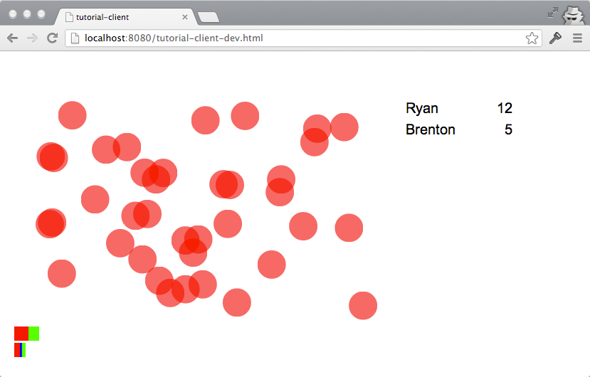

# Pedestal-app Tutorial [](https://travis-ci.org/pedestal/app-tutorial)

Welcome to the Pedestal-app Tutorial! This tutorial will guide you step-by-step through pedestal-app in its entirety.

The tutorial is located in the [Wiki](../../wiki) and is composed of 34 sections across two parts. During the course
of the tutorial you'll construct an interactive multi-player bubble-popping game that exercises nearly every nook and
cranny of pedestal-app.

### [Get Started!](../../wiki)



## Contributing

Oh my, how gracious of you. It's a little bit more difficult than a typical software to contribute to the tutorial
however; We have ~34 tags to maintain as pointers from the tutorial, and the Wiki is locked away in GitHub-wikidom.

If you're desperate to help, reach out by [creating an issue](../../issues/new), and we'll see what we can do.

## Running the final game

It's easiest to follow along in the tutorial, but if you'd like to run the final game follow these steps. It's
assumed you have [leiningen](https://github.com/technomancy/leiningen#installation) installed.

```bash
git clone https://github.com/pedestal/app-tutorial
cd app-tutorial

# In one terminal
cd tutorial-client
lein repl
> (dev)
> (watch :development)

# In another terminal
cd tutorial-service
lein repl
> (use 'dev)
> (start)
```

Now visit <http://localhost:8080/tutorial-client-dev.html> and "log in" (just pick a name :wink:). Get poppin'!

## Find out more

* Visit the [pedestal repo](https://github.com/pedestal/pedestal)
* Follow [@pedestal_team on Twitter](http://twitter.com/pedestal_team)
* Subscribe to [pedestal-users](https://groups.google.com/d/forum/pedestal-users)

---

## License
Copyright 2013 Relevance, Inc.

The use and distribution terms for this software are covered by the
Eclipse Public License 1.0 (http://opensource.org/licenses/eclipse-1.0)
which can be found in the file [epl-v10.html](epl-v10.html) at the root of this distribution.

By using this software in any fashion, you are agreeing to be bound by
the terms of this license.

You must not remove this notice, or any other, from this software.
